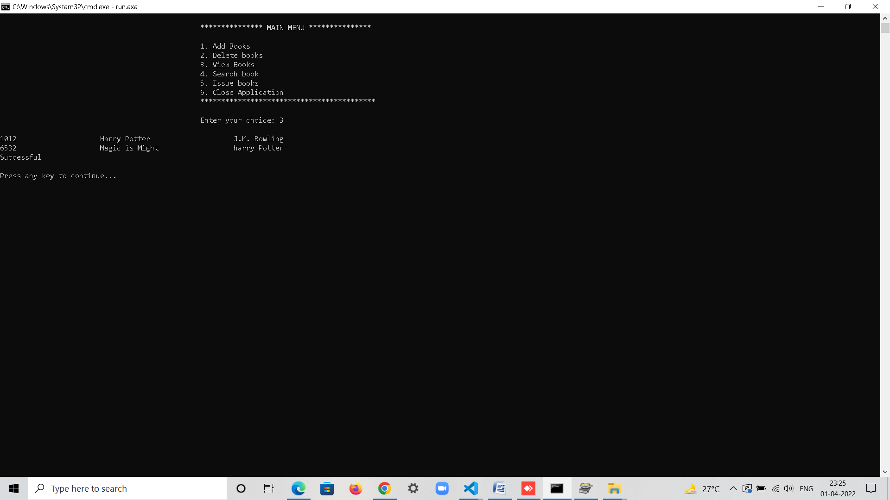
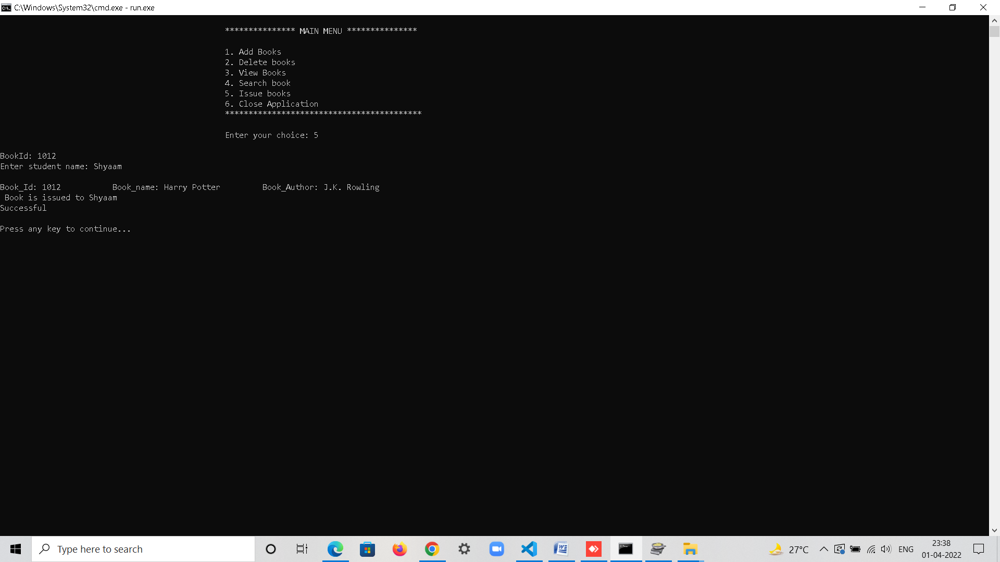

# M1_LibraryManagementSystem

## Commands:
### Running code:
> `make all`  
> `./run.exe`

### Unit testing:
> `make unittest`  
> `./test.exe`

## Screenshots

### Add New books

### View books

### Issue books

### Search books

### Delete books

