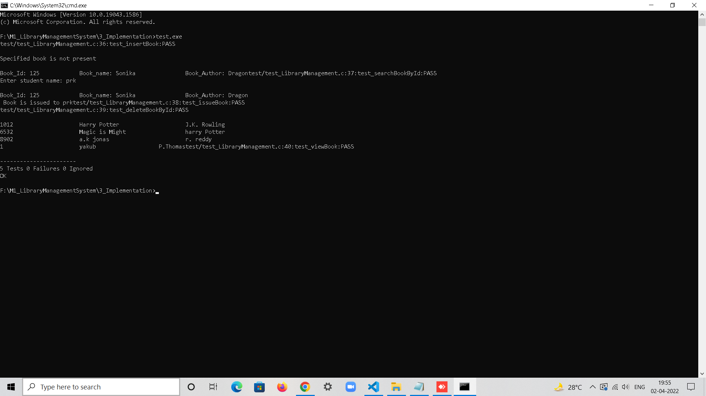

# M1_LibraryManagementSystem

* The Library management System is a project that manages and stores books data electronically ,monitors and controls the transactions in a library. 
* The project Library Management System is developed using C, which mainly focuses on basic operations in a library like :
* adding new books 
* updating new information 
* searching books 
* return books

## Commands:
### Running code:
> `make all`  
> `./run.exe`

### Unit testing:
> `make unittest`  
> `./test.exe`

## Folder Structure
|FOLDER|DESCRIPTION|
|:-----|:----------|
|1_Requirements|Documents detailing requirements|
|2_Architecture|Structural and Behavioural UML|
|3_Implementation|All the code is written here|
|4_TestPlanAndOutput|Documents with test plans and outputs|
|5_Report|Generated Report|
|6_ImagesandVideos|All the images and program execution video|

## Screenshots

### Add New books

### View books

### Issue books

### Search books

### Delete books

### Unit Testing

# Badge

